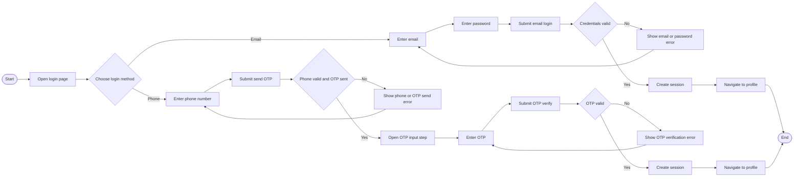
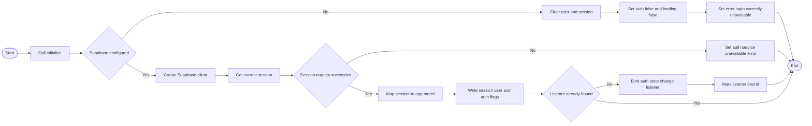
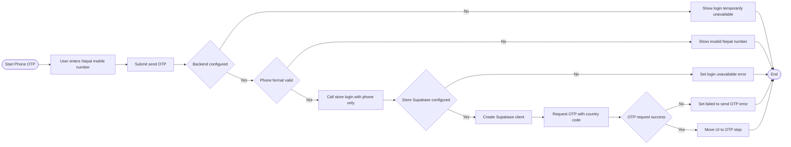
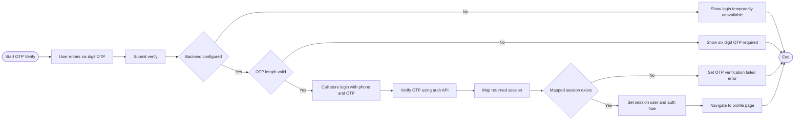
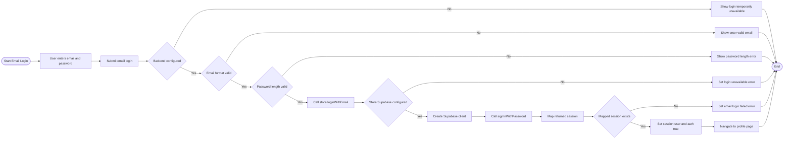
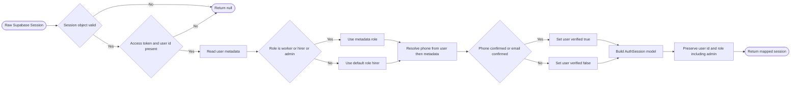
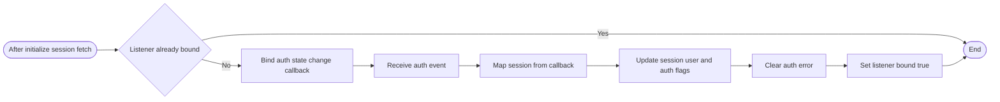
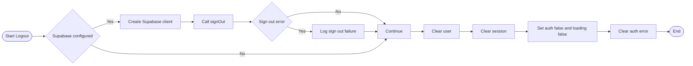

# Auth Session Mermaid Flowcharts

This document captures auth session flowcharts for each sub-task in the web auth flow.

## 0. Combined Login UI UX Flow

## 1. Initialize Auth Session on App Start

## 2. Phone OTP Request

## 3. OTP Verification and Session Create

## 4. Email Password Login

## 5. Session Mapping Rules Including Admin

## 6. Auth State Change Listener

## 7. Logout and Local Cleanup

## 8. Admin ID Email Login Smoke Test

```mermaid
flowchart LR
  S([Start Test]) --> A[Mock signInWithPassword with admin session]
  A --> B[Call loginWithEmail with admin credentials]
  B --> C[Expect function result true]
  C --> D[Expect API call arguments match]
  D --> E[Read store state]
  E --> F[Assert auth true]
  F --> G[Assert user id is admin id]
  G --> H[Assert role is admin]
  H --> I[Assert verified true]
  I --> X([End])
```

